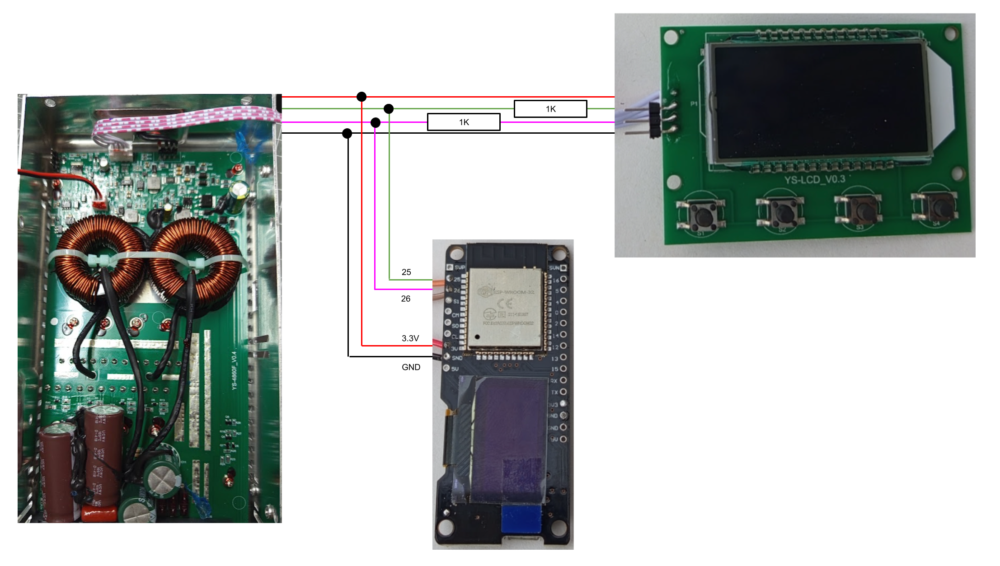

# Sniffer for EASUN 6048 Display connection and Protocol
Sniffer for EASUN 6048 to get DISPLAY to Mainctrl protocoll


This describes a Sniffer for the EASUN 6048. This tool was used to get the protocol from the main controller to the Display.
This doc was made with "https://stackedit.io/app#"

# Hardware

I used a **wemos lolin32 oled** bord. I connected the pins 25 and pin 26 to the EASUN display connection.


## Serial Connection
```
Baudrate = 9600
Bits = 8N1
```

## Connection on the Display


On the Display you need 3 connections: GND,TX,RX

# Software used
The software used ca be found under "easun6048_display_sniffer". The messages of the protocol are found in the webpage of the esp32.

# Protocol itself

## main structure
| byte | meaning  | example |
|--|--|--|
|0| startbyte, constant | 125 | 
|1| length of the payload| 1 |
|2| payload | 1 |
|2+n| more data| |
|end-1| checksum | 2 |
| end | stopbyte | 13 |

### startbyte field
This is constant an always 125

### stopbyte field
This is constant an always 13

### checksum-field
this is the sum of byte[1] ....byte[end-2]. So ist is the bytesum of the len-field and all data fields. Example:
```
[125,16,3,0,32,12,0,0,0,121,0,0,0,0,18,0,0,46,248,13]
```
The checksum is 248 = 16+3+32+12+121+18+46
The checksum is a **uint8_t**, so it wrapes at 256. 

### len-field
This field only count the payload. So the total protocol length is **len+4**.

## protocols used

### the display ask the  main controller for actual state/measurements
(data=3): [125,1,3,4,13]

### the display ask the  main controller for active setting
(data=2): [125,1,2,3,13]

## the display send the main controller new setting
(data=1)  
examples:  
boost voltage to 13.9V:  
[125,10,1,12,4,139,135,139,132,126,111,5,46,13]  
boost voltage to 14.5V:  
[125,10,1,12,4,143,145,143,132,126,111,5,64,13]  
boost voltage to 13V:  
[125,10,1,12,4,145,130,145,132,126,111,5,53,13]  
boost voltage to 14V:  
[125,10,1,12,4,130,140,130,132,126,111,5,33,13]  
boost voltage to 13V:  
[125,10,1,12,4,140,130,140,132,126,111,5,43,13]  
boost voltage to 13V:  
[125,10,1,12,4,130,130,130,132,126,111,5,23,13]  

The protocol itself is the same as the "answer from main controller for active setting", except:
```
byte[2] = type of communication: (new_settings=1) 
```

### answer from main controller for actual state/measurements
on the request |3| the controller answers with [3], active mesurements/status.
examples:  
[125,16,3,0,32,12,0,0,0,121,0,0,0,0,18,0,0,46,248,13]  
[125,16,3,0,32,12,0,0,0,121,0,0,0,0,18,0,0,45,247,13]  
```
 byte[0] = startbyte  
 byte[1] = len payload  
 byte[2] = type of communication: (status=3)  
 byte[3] = unknown  
 byte[4] = unknown  
 byte[5] = unknown  
 byte[6] = unknown  
 byte[7] = unknown  
 byte[8] , byte[9] = batterie voltage : ( byte[8]*256 + byte[9] ) / 10  
 byte[10] , byte[11] = PV voltage : ( byte[10]*256 + byte[11] ) / 10  
 byte[12] , byte[13] = battery current : ( byte[12]*256 + byte[13] ) / 10  
 byte[14] = controller temperature  
 byte[15] = unknown  
 byte[16] = unknown  
 byte[17] = unknown  
 byte[18] = checksum  
 byte[19] = stopbyte  
```
thanks to: "https://github.com/profesor79/easun6040reader/blob/main/readerWip.ino"  

### answer from main controller for active setting
on the request |2| the controller answers with [2], active setting.  
examples:  
[125,10,2,12,4,139,139,139,132,126,111,5,51,13]  
[125,10,2,12,4,135,135,135,132,126,111,5,39,13]  
[125,10,2,12,4,145,145,145,132,126,111,5,69,13]  
[125,10,2,12,4,130,130,130,132,126,111,5,24,13]  
[125,10,2,12,4,140,140,140,132,126,111,5,54,13]  

```
 byte[0] = startbyte
 byte[1] = len payload
 byte[2] = type of communication: (act_settings=2) 
 byte[3] = battery nominal voltage [12,24,36,48]
 byte[4] = battery type: 0 = GEL , 4 = Li
 byte[5] = EQU 9..16V = 90..160
 byte[6] = BST 9..16V = 90..160
 byte[7] = FLD 9..16V = 90..160
 byte[8] = BSTR 9..16V = 90..160
 byte[9] = LRV 9..16V = 90..160
 byte[10] = LDV 9..16V = 90..160
 byte[11] = Load 0..10
 byte[12] = checksum
 byte[13] = stopbyte
```

# paket injection to change the settings
The communication between the display and the mainctrl uses a start token. This token is send from the display to the mainctrl, it has about 100bytes and changes every startup time. I wasnt able to decrypt it. Also if i tried to copy that token und send it directly to the mainctrl wasnt successful. 
So I decided to inject pakages in the running communication between the display and the mainctrl.

For that, the ESP uses pin 25 and 26 for lissening ( 25:rx , 26,rx) of packages. If there is a request, that the boost voltage shall be changed, the ESP change from rx to tx, inject the package, and than return bach to rx.

There are several advantages for that operation:
- no token needed :-)
- the dispaly is still working

The used software can be found under "easun6048_display_mitm".




